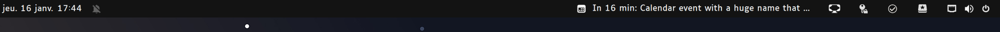
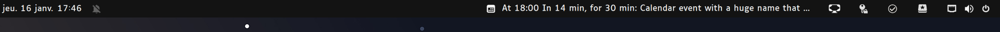
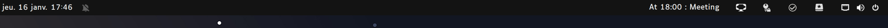

# Presentation

This is a gnome extension to display the next events from your gnome calendar.
This extension works for gnome 40 and above.

## How to develop ?

To test this application without the need to logout, you can use the following command:

```bash
env MUTTER_DEBUG_DUMMY_MODE_SPECS=1920x1080 \
dbus-run-session -- gnome-shell --nested --wayland
```

To update the schemas with new parameters :

```bash
glib-compile-schemas .
```

### Building for distribution

To prepare the extension for publication:

1. **Update translations:**

   ```bash
   ./generate-pot.sh
   ./compile-translations.sh
   ```

2. **Create package:**

   ```bash
   # Create a clean build
   zip -r event-bar@gautierlabarre.github.com.zip \
     extension.js prefs.js metadata.json stylesheet.css \
     src/ schemas/ locale/ assets/
   ```

3. **Test the package:**
   ```bash
   gnome-extensions install event-bar@gautierlabarre.github.com.zip
   ```





## How to use ?

First, synchronize your calendar with your gnome calendar. Then, you can install the extension from the gnome extensions website and activate it. It's possible that it takes a few moment to load the events at first.

## Features

- Show next event from your gnome calendar
- Show current event
- You can personalize the look in the settings
- You can even hide the event name
- The size of the event is configurable
- 🌍 Full internationalization support (i18n)

## 🌍 Translations

Event Bar supports internationalization and is currently available in:

- **🇺🇸 English** (default)
- **🇫🇷 French** (Français)

### How it works

The extension automatically detects your system language and displays:

- Interface elements (preferences, menus)
- Event status messages ("Loading", "Ends in X minutes", etc.)
- Time formats and duration displays

### Testing different languages

1. Go to **Settings** → **Region & Language** → **Language**
2. Select your preferred language
3. Reload the extension:
   ```bash
   gnome-extensions disable event-bar@gautierlabarre.github.com
   gnome-extensions enable event-bar@gautierlabarre.github.com
   ```

### Contributing translations

Want to add your language? Here's how:

1. **Generate translation template:**

   ```bash
   ./generate-pot.sh
   ```

2. **Create your language file:**

   ```bash
   cd po/
   msginit --locale=YOUR_LANGUAGE --input=event-bar@gautierlabarre.github.com.pot --output=YOUR_LANGUAGE.po
   ```

   Examples:

   - German: `msginit --locale=de --input=event-bar@gautierlabarre.github.com.pot --output=de.po`
   - Spanish: `msginit --locale=es --input=event-bar@gautierlabarre.github.com.pot --output=es.po`

3. **Edit the `.po` file** with your translations

4. **Compile translations:**

   ```bash
   ./compile-translations.sh
   ```

5. **Test your translation** and submit a pull request!

## Next feature (help is welcome)

- Another wording for the event (to gain space)
- More translation languages (German, Spanish, Italian, etc.)
- ?? Feel free to add an issue

## How to develop ?
To test this application without the need to logout, you can use the following command:

```bash
env MUTTER_DEBUG_DUMMY_MODE_SPECS=1920x1080 \
dbus-run-session -- gnome-shell --nested --wayland
```

To update the schemas with new parameters :

```bash
glib-compile-schemas .
```

## Thanks

- https://github.com/artisticat1/gnome-next-up this project is based on this one
